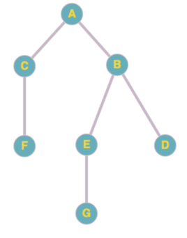

#Обход в глубину
Обойти все вершины невзвешенного графа,
к каждой из которых придя с помощью обхода в глубину

## Начальные условия
1. Нужен список (множество) посещенных вершин,
куда добавляем начальную вершину

## Алгоритм
1. Взять стартовую вершину добавить ее в список посещенных.
2. От каждого соседа рекурсивно запустить поиск в глубину, 
   то есть по факту сосед становится новым стартовым узлом.
   
## Задача
1. Написать алгоритм обхода в глубину

