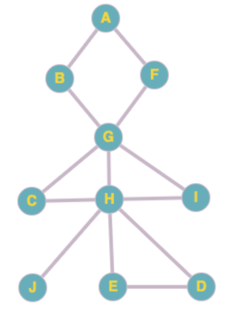

#Обход в ширину
Обойти все вершины невзвешенного графа,
к каждой из которых придя кратчайшим путем

## Начальные условия
1. Нужен список (множество) посещенных вершин,
куда изначально добавляем начальную вершину
2. Нужна очередь, в которую добавляем начальную вершину

## Алгоритм
1. Взять вершину из очереди.
2. Взять всех соседей этой вершины.
3. Для всех соседей соседа: если вершина не посещена, то добавить ее в конец очереди и
в список посещенных.
   
## Задача
1. Написать алгоритм обхода в ширину
2. Записать граф и получить список узлов, в порядке из посещения. Стартовый узел `A`

