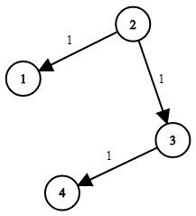

Вам предоставляется сеть из n узлов, помеченных от 1 до n. Вам также дается время, список времени прохождения в соответствии 
с указаниями times[i] = (ui, vi, wi), где ui - исходный узел, vi - целевой узел, а wi - время, необходимое сигналу 
для прохождения от источника до цели.

Мы отправим сигнал с заданного узла k. Возвращает минимальное время, необходимое всем n узлам для получения сигнала. 
Если все n узлов не могут принять сигнал, верните значение -1.

Пример 1:

Input: times = [[2,1,1],[2,3,1],[3,4,1]], n = 4, k = 2

Output: 2

Пример 2:

Input: times = [[1,2,1]], n = 2, k = 1

Output: 1

Пример 3:

Input: times = [[1,2,1]], n = 2, k = 2

Output: -1

[leetcode](https://leetcode.com/problems/network-delay-time/)

В задаче предлагается использовать [heapq](https://docs.python.org/3/library/heapq.html) - Алгоритм очереди кучи.

Этот модуль обеспечивает реализацию алгоритма очереди кучи, также известного как алгоритм очереди приоритетов.

Кучи — это бинарные деревья, для которых каждый родительский узел имеет значение, меньшее или равное любому из его дочерних элементов.
