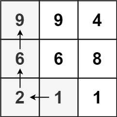
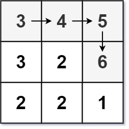

*Повышенная сложность

Учитывая матрицу целых чисел mxn, верните длину самого длинного возрастающего пути в матрице.

Из каждой ячейки вы можете перемещаться в четырех направлениях: влево, вправо, вверх или вниз. 
Вы не можете перемещаться по диагонали или выходить за пределы границы (т.е. обход за границы не допускается).

Пример 1:

Input: matrix = [[9,9,4],[6,6,8],[2,1,1]]

Output: 4

Пояснение: Самый длинный возрастающий путь - это [1, 2, 6, 9].

Пример 2:

Input: matrix = [[3,4,5],[3,2,6],[2,2,1]]

Output: 4

Пояснение: Самый длинный возрастающий путь - это [3, 4, 5, 6]. Перемещение по диагонали не допускается.

Пример 3:

Input: matrix = [[1]]

Output: 1

[leetcode](https://leetcode.com/problems/longest-increasing-path-in-a-matrix/)