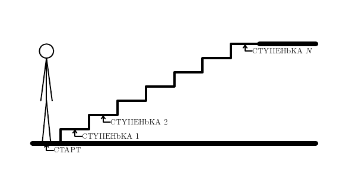

Мальчик подошел к лестнице.  
Мальчик умеет перешагивать на следующую ступеньку, либо перепрыгивать через ступеньку.  
Требуется узнать, какое количество маршрутов существует, чтобы добраться до каждой ступени.  

Алгоритм может быть следующим:

1. Определяем начальные условия:
    - f(0) = 1, т.к. есть один способ добраться до верха, если ступеней нет
    - f(1) = 2, т.к. есть два способа добраться до верха, если есть только одна ступень
2. Для i от 2 до n:
    f(i) = f(i-1) + f(i-2), т.к. число вариантов можно получить суммированием числа вариантов, которые привели к предыдущим ступеням
2. Возвращаем f(n), что является ответом на задачу
