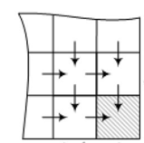

Рассмотрим двумерные задачи динамического программирования.

Дана ракета. Ракета может перемещаться строго на клетку вниз или вправо.  
У каждой клетки есть стоимость её посещения, вне зависимости откуда в неё попали.
Рассчитать минимальную стоимость перемещения ракеты из верхнего левого угла в нижний правый.

