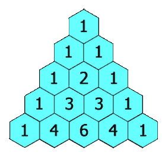

На вход подаётся целое число `num_rows`, верните первые числа треугольника Паскаля.

В треугольнике Паскаля каждое число является суммой двух чисел непосредственно над ним, как показано:

Пример 1:

Input: `num_rows` = 5

Output: [[1],[1,1],[1,2,1],[1,3,3,1],[1,4,6,4,1]]

Пример 2:

Input: `num_rows` = 1

Output: [[1]]

[leetcode](https://leetcode.com/problems/pascals-triangle/)