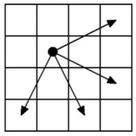

Динамическое программирование может использоваться для решения задачи хода коня на шахматной доске.  
Оно позволяет находить минимальное число ходов для перехода коня с одной клетки на другую.

Дана прямоугольная доска N×M (N строк и M столбцов).  
В левом верхнем углу находится шахматный конь, которого необходимо переместить в правый нижний угол доски.  
При этом конь может ходить только так, как показано на рисунке, конь не может выходить за границы доски.

    Не забывайте про кеширование, иначе все будет долго считаться ...

