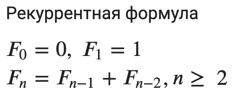

Рекурсивный алгоритм для вычисления чисел Фибоначчи использует рекурсию для вычисления каждого числа в последовательности.  
Он использует два базовых (или терминальных) случая: 
    - если `n == 0`, то функция возвращает 0
    - если `n == 1`, то она возвращает 1.  

Во всех остальных случаях она вызывает себя два раза с аргументами `n-1` и `n-2`,чтобы вычислить два предыдущих числа в последовательности, и суммирует их в качестве результата.

При кажущейся простоте реализации, алгоритм обладает главный минусом это сложность алгоритма `O(2^N)`. Что очень и очень плохо...
