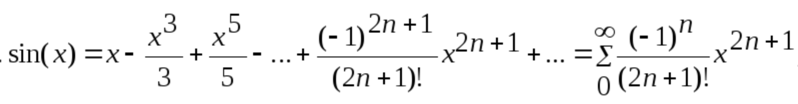

Ряд Тейлора — это метод аппроксимации функций, используемый для приближенного вычисления значений функций, для которых нет простых аналитических формул.  
Ряд Тейлора представляет функцию как сумму бесконечной последовательности разложения, вычисленных по рекуррентной формуле.

Ряд Тейлора для sin(x) задается следующей формулой:

Если очередной элемент суммы бесконечного ряда становится меньше некоторого значения `DELTA`, то мы достигли необходимой точности вычислений.
