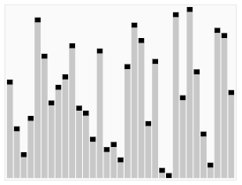

Быстрая сортировка (QuickSort) — это алгоритм сортировки по принципу «разделяй и властвуй», который использует рекурсию для сортировки массива элементов.  

Основная идея QuickSort состоит в том, чтобы выбрать опорный элемент из массива и разделить остальные элементы на два подмассива в зависимости от того, меньше они или больше опорного элемента.  
Затем подмассивы сортируются рекурсивно.  
Этот процесс продолжается до тех пор, пока не будет достигнут базовый случай, когда подмассив содержит менее двух элементов и уже отсортирован.  

Временная сложность QuickSort в среднем составляет `O(n log n)`, но в худшем случае может быть `O(n^2)` (очень редкий случай).  
Несмотря на это, QuickSort является популярным и эффективным алгоритмом сортировки больших наборов данных, так как имеет небольшой постоянный коэффициент и прост в реализации.

