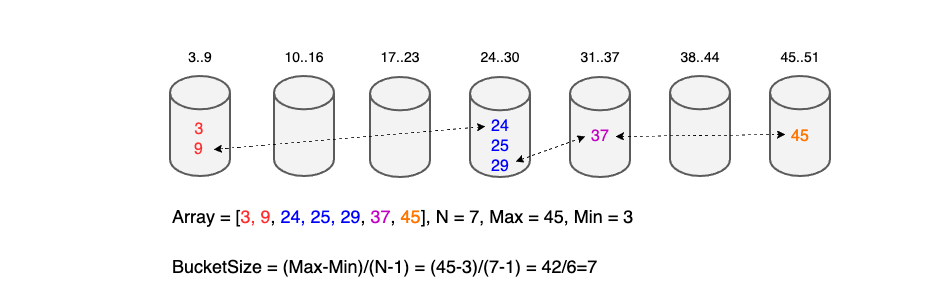

На вход подаётся целочисленный массив `nums`, вернуть максимальную разницу между двумя последовательными элементами 
в отсортированном виде. Если массив содержит менее двух элементов, вернуть 0.

**Пример 1**:

**Input**: nums = [3,6,9,1]

**Output**: 3

**Объяснение**: Отсортированная форма массива равна [1,3,6,9], либо (3,6), либо (6,9) имеет максимальную разницу 3.

**Пример 2**:

**Input**: nums = [10]

**Output**: 0

[leetcode](https://leetcode.com/problems/maximum-gap/)

***Повышенная сложность** (Вы должны написать алгоритм, работающий за линейное время и использующий линейную дополнительную память.)

**Идея**

Предположим, что в наших `N` элементах целочисленного массива минимальное значение равно `min` , а максимальное значение равно `max` . 
Тогда максимальный зазор будет больше или равен `ceiling[(max - min ) / (N - 1)]`.

Пусть `bucket_size = ceiling[(max - min ) / (N - 1)]`.

Делим все числа в массиве на N вёдер, каждое ведро имеет размер `bucket_size`, где i-ый (отсчитываемый от нуля индекс) ведро 
содержит все числа в диапазоне `[min + i*bucket_ize, min + (i+1)*bucket_ize)]`.

Поскольку максимальный разрыв всегда больше или равен этому `bucket_size` значению в каждом сегменте, 
нам нужно хранить только максимальный элемент и минимальный элемент, пропускать средние элементы `(min < middle < max)` в одном сегменте.

Наконец, нужно только сравнить максимальное число в текущем сегменте и минимальное число в следующем сегменте, 
чтобы получить относительно большой разрыв и выяснить, какие два сегмента имеют максимальный разрыв.

